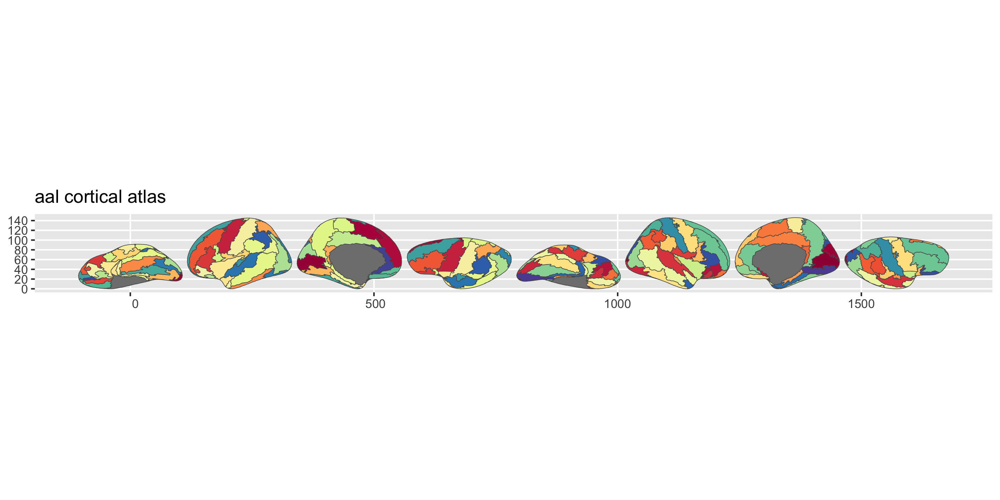

<!-- README.md is generated from README.qmd. Please edit that file -->

# ggsegAal 

<!-- badges: start -->

[](https://github.com/ggseg/ggsegAal/actions)
[](https://zenodo.org/badge/latestdoi/417464916)
<!-- badges: end -->

This package contains the AAL (Automated Anatomical Labeling) atlas for
the [ggseg](https://ggseg.github.io/ggseg/) and
[ggseg3d](https://ggseg.github.io/ggseg3d/) plotting packages. The
template files were obtained from
[faskowit/multiAtlasTT](https://github.com/faskowit/multiAtlasTT).

Rolls, E. T., Joliot, M., & Tzourio-Mazoyer, N. (2015). Implementation
of a new parcellation of the orbitofrontal cortex in the automated
anatomical labeling atlas. Neuroimage, 122, 1-5.

## Installation

We recommend installing the ggseg-atlases through the ggseg
[r-universe](https://ggseg.r-universe.dev/ui#builds):

``` r
options(repos = c(
  ggseg = "https://ggseg.r-universe.dev",
  CRAN = "https://cloud.r-project.org"
))

install.packages("ggsegAal")
```

You can install ggsegAal from [GitHub](https://github.com/) with:

``` r
# install.packages("remotes")
remotes::install_github("ggseg/ggsegAal")
```

## Example

``` r
library(ggsegAAL)
library(ggseg)
library(ggplot2)

ggplot() +
  geom_brain(
    atlas = aal(),
    mapping = aes(fill = label),
    position = position_brain(hemi ~ view),
    show.legend = FALSE
  ) +
  scale_fill_manual(values = aal()$palette, na.value = "grey") +
  theme_void()
```



``` r
library(ggseg3d)

ggseg3d(atlas = aal()) |>
  pan_camera("right lateral")
```


Please note that the ‘ggsegAal’ project is released with a [Contributor
Code of Conduct](CODE_OF_CONDUCT.md). By contributing to this project,
you agree to abide by its terms.
