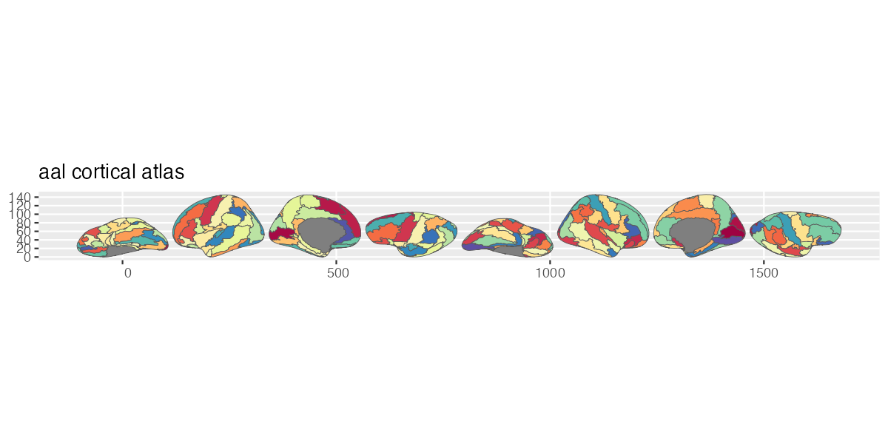
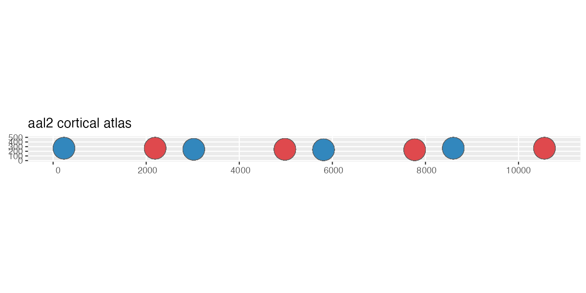
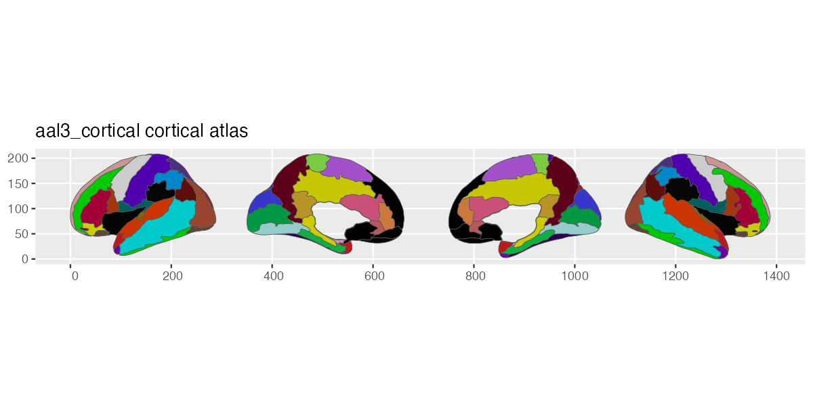
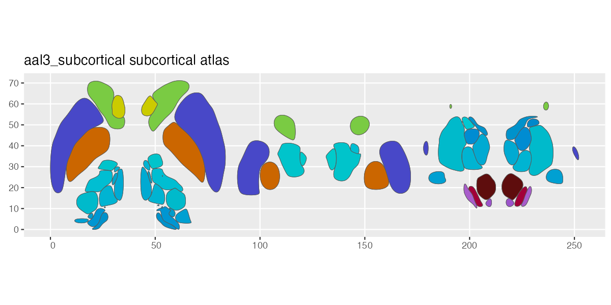
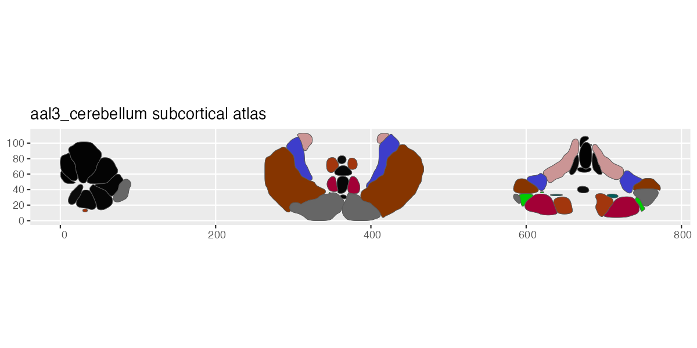

# ggsegAal

<!-- badges: start -->
[](https://github.com/ggsegverse/ggsegAal/actions/workflows/R-CMD-check.yaml)
[](https://ggsegverse.r-universe.dev/ggsegAal)
<!-- badges: end -->

AAL Atlases for the ggsegverse Ecosystem.

## Installation

``` r
# From r-universe
install.packages("ggsegAal", repos = "https://ggsegverse.r-universe.dev")

# From GitHub
# install.packages("remotes")
remotes::install_github("ggsegverse/ggsegAal")
```

## Usage

``` r
library(ggsegAal)
library(ggseg)

plot(aal()) +
  theme_brain()
```

## Atlases

### aal

Automated Anatomical Labeling parcellation (Tzourio-Mazoyer et al., 2002).



### aal2

AAL2 parcellation (Rolls et al., 2015) with updated orbitofrontal cortex.



### aal3\_cortical

AAL3 cortical parcellation (Rolls et al., 2020).



### aal3\_subcortical

AAL3 subcortical parcellation covering basal ganglia and thalamic nuclei.



### aal3\_cerebellum

AAL3 cerebellar parcellation.



## Data sources

| Atlas | Source | Reference | Date obtained |
|-------|--------|-----------|---------------|
| aal | FreeSurfer fsaverage5 annotation | Tzourio-Mazoyer et al. (2002) [doi:10.1006/nimg.2001.0978](https://doi.org/10.1006/nimg.2001.0978) | 2021-10-15 |
| aal2 | FreeSurfer fsaverage5 annotation | Rolls et al. (2015) [PubMed:26241684](https://pubmed.ncbi.nlm.nih.gov/26241684/) | 2021-10-15 |
| aal3\_cortical | FreeSurfer fsaverage5 annotation | Rolls et al. (2020) [doi:10.1016/j.neuroimage.2020.116189](https://doi.org/10.1016/j.neuroimage.2020.116189) | 2021-10-15 |
| aal3\_subcortical | AAL3 volumetric atlas | Rolls et al. (2020) [doi:10.1016/j.neuroimage.2020.116189](https://doi.org/10.1016/j.neuroimage.2020.116189) | 2021-10-15 |
| aal3\_cerebellum | AAL3 volumetric atlas | Rolls et al. (2020) [doi:10.1016/j.neuroimage.2020.116189](https://doi.org/10.1016/j.neuroimage.2020.116189) | 2021-10-15 |
