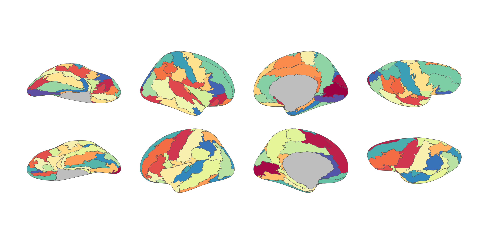
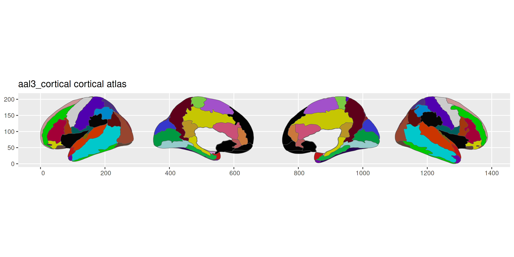
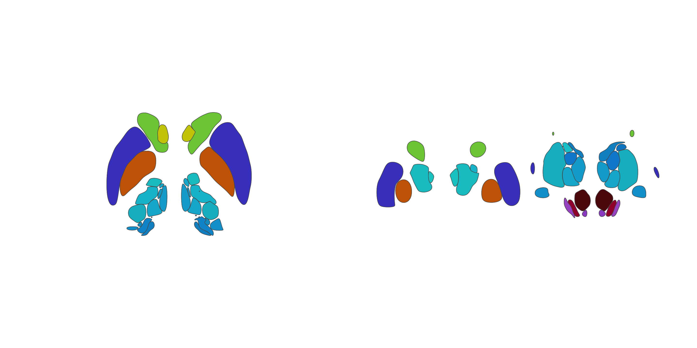

<!-- README.md is generated from README.qmd. Please edit that file -->

# ggsegAal 

<!-- badges: start -->

[](https://github.com/ggsegverse/ggsegAal/actions/workflows/R-CMD-check.yaml)
[](https://ggseg.r-universe.dev/ggsegAAL)
<!-- badges: end -->

This package contains the AAL (Automated Anatomical Labeling) atlas for
the [ggseg](https://ggseg.github.io/ggseg/) plotting packages.

Rolls ET, Joliot M, & Tzourio-Mazoyer N (2015). Implementation of a new
parcellation of the orbitofrontal cortex in the automated anatomical
labeling atlas. *Neuroimage*, 122, 1-5.

## Installation

We recommend installing the ggseg-atlases through the ggseg
[r-universe](https://ggseg.r-universe.dev/ui#builds):

``` r
options(repos = c(
  ggseg = "https://ggseg.r-universe.dev",
  CRAN = "https://cloud.r-project.org"
))

install.packages("ggsegAAL")
```

You can install this package from [GitHub](https://github.com/) with:

``` r
# install.packages("pak")
pak::pak("ggsegverse/ggsegAal")
```

## AAL atlas

``` r
library(ggseg)
library(ggsegAAL)

plot(aal())
```



## AAL2 atlas

``` r
plot(aal2())
```


## AAL3 cortical atlas

``` r
plot(aal3_cortical())
```



## AAL3 subcortical atlas

``` r
plot(aal3_subcortical())
```



## AAL3 cerebellum atlas

``` r
plot(aal3_cerebellum())
```


## Data source

Rolls ET, Huang CC, Lin CP, Feng J, & Joliot M (2020). Automated
anatomical labelling atlas 3. *Neuroimage*, 206, 116189.
