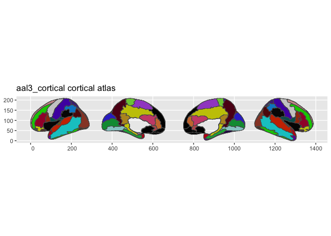
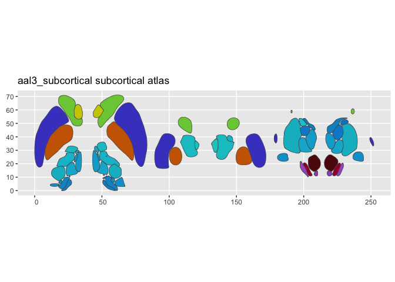
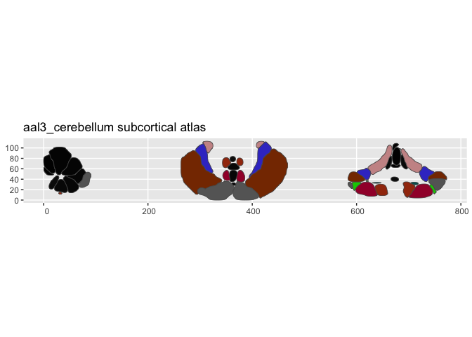

# ggsegAal

AAL Atlases for the ggsegverse Ecosystem.

## Installation

``` r
# From r-universe
install.packages("ggsegAAL", repos = "https://ggsegverse.r-universe.dev")

# From GitHub
# install.packages("remotes")
remotes::install_github("ggsegverse/ggsegAal")
```

## Atlases

### aal

Automated Anatomical Labeling parcellation (Tzourio-Mazoyer et al.,
2002).

``` r
library(ggsegAAL)
plot(aal())
```


### aal2

AAL2 parcellation (Rolls et al., 2015).

``` r
plot(aal2())
```


### aal3_cortical

AAL3 cortical parcellation (Rolls et al., 2020).

``` r
plot(aal3_cortical())
```



### aal3_subcortical

AAL3 subcortical parcellation.

``` r
plot(aal3_subcortical())
```



### aal3_cerebellum

AAL3 cerebellar parcellation.

``` r
plot(aal3_cerebellum())
```

 \## Data source

FreeSurfer fsaverage5 annotations.

- **Reference**: Tzourio-Mazoyer et al. (2002)
  [doi:10.1006/nimg.2001.0978](https://doi.org/10.1006/nimg.2001.0978)
- **Date obtained**: 2021-10-15
